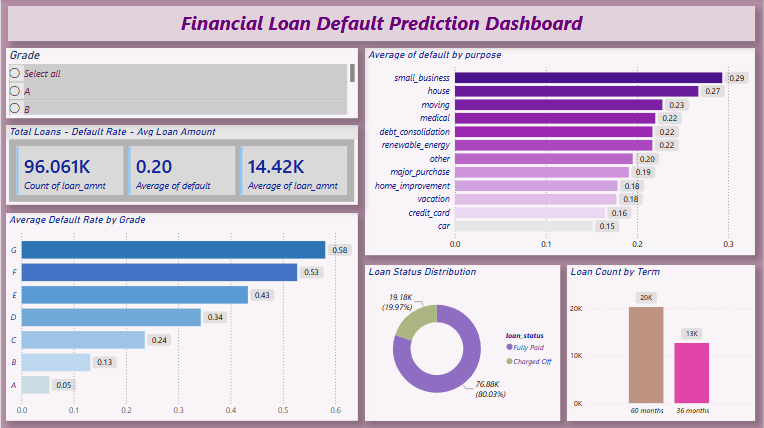

# 🏦 Financial Loan Default Prediction

---

## 📌 Project Overview

An end-to-end data analytics and machine learning project to predict loan default risk using **96,000+ real Lending Club loan records**. Built for Data Analyst fresher roles targeting Finance, Fintech, and Banking sectors.

---

## ❓ Business Problem

Banks lose significant money when borrowers fail to repay loans. This project analyzes 96,000+ loan records to identify key risk factors and build a predictive model that flags high-risk applications before approval.

---

## 🛠️ Tools Used

| Tool | Purpose |
|---|---|
| Python | Data cleaning, EDA, Machine Learning |
| Pandas, NumPy | Data manipulation |
| Matplotlib, Seaborn | Data visualization |
| Scikit-learn | Machine learning models |
| Google Colab | Development environment |
| Power BI | Interactive dashboard |
| GitHub | Portfolio hosting |

---

## 🔍 Key Findings

- 📊 Grade A loans default only **5.3%** vs Grade G at **57.9%**
- 💼 Small business loans have highest default risk at **29.4%**
- 💰 High DTI borrowers default **30%** vs **14%** for low DTI
- ⚠️ Overall dataset default rate is **20%**

---

## 📁 Project Structure

Financial-Loan-Default-Prediction/
├── Data/
│   └── loan_data_clean.csv
├── Notebooks/
│   └── Loan_Default_Prediction.ipynb
├── PowerBI/
│   └── Fiancial_Loan_Default.pbix
├── Reports/
│   ├── Business_Recommendations.pdf
│   └── Model_Evaluation_Summary.pdf
├── Visuals/
│   ├── 01_default_distribution.png
│   ├── 02_loan_count_by_grade.png
│   ├── 03_default_rate_by_grade.png
│   ├── 04_default_rate_by_income.png
│   ├── 05_default_rate_by_purpose.png
│   ├── 06_default_rate_by_dti.png
│   ├── 07_correlation_heatmap.png
│   └── 08_powerbi_dashboard.png
└── README.md

---

## 📊 Dashboard Preview

---

## ⚙️ Project Steps

### 🧹 Phase 3 — Data Cleaning
- Removed missing and unrealistic values
- Capped income outliers at 99th percentile ($260,834)
- Filled 12,103 missing employment length values with Not Disclosed
- Removed 9 rows with DTI above 100

### 📈 Phase 4 — Exploratory Data Analysis
- Analyzed default rate by grade, income, purpose and DTI
- Built correlation heatmap for numeric relationships
- Key finding: Grade is the strongest predictor of default

### 🤖 Phase 6 and 7 — Machine Learning and Evaluation

| Model | Accuracy | Recall (Default) | Precision (Default) |
|---|---|---|---|
| Logistic Regression | 67% | 65% | 34% |
| Random Forest | 80% | 14% | 51% |

✅ **Logistic Regression selected as final model**

Recall was prioritized over accuracy because missing a real defaulter costs the bank more than a false alarm. Random Forest had higher accuracy but missed most real defaulters (only 14% recall).

### 📊 Phase 9 — Power BI Dashboard
Interactive dashboard featuring:
- 3 KPI cards (Total Loans, Default Rate, Avg Loan Amount)
- Grade slicer for interactive filtering
- Default rate by Grade chart
- Default rate by Purpose chart
- Loan Status donut chart
- Loan Count by Term chart

---

## 💡 Business Recommendations

1. Use loan grade as primary risk filter
2. Add extra manual checks for high DTI borrowers
3. Apply stricter criteria for small business loans
4. Use the model to flag risky applications for manual review before approval

---

## 📂 Dataset Source

Lending Club Loan Data — available on Kaggle.
Raw file not uploaded due to file size (1.56GB).
Download from Kaggle and place in the Data folder.

---

## 🔗 Connect With Me

- 💼 LinkedIn: [Anand Prajapati](https://linkedin.com/in/anand-prajapati-572a9a395)
- 🐙 GitHub: [anandprajapati0806-cloud](https://github.com/anandprajapati0806-cloud)
